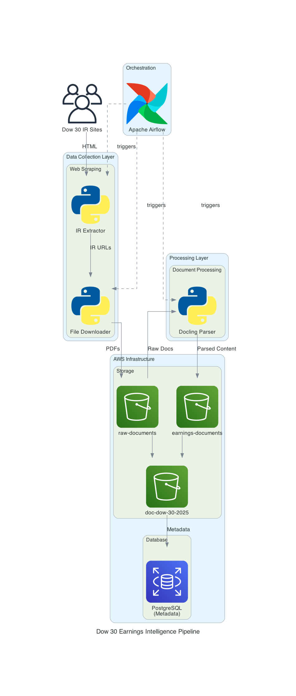

# Dow 30 Earnings Pipeline - Setup & Run Instructions

A Short Reflection on our project

https://docs.google.com/document/d/1UVFqRVt933GgO8byZSwh3C2L7rw7a6rs8Pdzu08OguQ/edit?tab=t.0#heading=h.gi8bntcs5c5h

10 min Video Demo

https://northeastern-my.sharepoint.com/:v:/g/personal/gandhi_di_northeastern_edu/EeGy73bIe5dNt5lRXclX2MUBhGql5XYF32kPyeGhBkUJJw?nav=eyJyZWZlcnJhbEluZm8iOnsicmVmZXJyYWxBcHAiOiJPbmVEcml2ZUZvckJ1c2luZXNzIiwicmVmZXJyYWxBcHBQbGF0Zm9ybSI6IldlYiIsInJlZmVycmFsTW9kZSI6InZpZXciLCJyZWZlcnJhbFZpZXciOiJNeUZpbGVzTGlua0NvcHkifX0&e=du1RAB

## Architecture



The pipeline consists of four main layers:

1. **Data Collection Layer**: Python-based web scraping to extract Investor Relations URLs and download quarterly reports from Dow 30 company websites
2. **Orchestration Layer**: Apache Airflow manages workflow scheduling, task dependencies, and automated execution
3. **Processing Layer**: Docling parser extracts structured content from PDF documents (text, tables, images)
4. **Storage Infrastructure**: AWS S3 buckets store raw and parsed documents, with PostgreSQL database for metadata management

## Prerequisites

### Required Software
- Python 3.8 or higher
- Google Chrome browser (latest version)
- Git
- AWS CLI

### System Requirements
- RAM: 8GB minimum (16GB recommended for parallel processing)
- Storage: 10GB free space
- OS: macOS, Linux, or Windows 10/11

## Installation Steps

### 1. Clone Repository
```bash
git clone https://github.com/DAMG7245-BigData-Team7/Automated-Dow-30-Earnings-Intelligence-Pipeline.git
cd Automated-Dow-30-Earnings-Intelligence-Pipeline
```

### 2. Python Virtual Environment
```bash
# Create virtual environment
python3 -m venv venv

# Activate environment
source venv/bin/activate  # On macOS/Linux
# OR
venv\Scripts\activate     # On Windows
```

### 3. Install Python Dependencies
```bash
pip install --upgrade pip
pip install -r requirements.txt
```

### 4. Install System Dependencies

#### macOS
```bash
# Install Homebrew if not present
/bin/bash -c "$(curl -fsSL https://raw.githubusercontent.com/Homebrew/install/HEAD/install.sh)"

# Install Graphviz (for diagrams)
brew install graphviz
```

#### Linux (Ubuntu/Debian)
```bash
sudo apt update
sudo apt install -y graphviz chromium-driver
```

#### Windows
- Download Chrome from https://www.google.com/chrome/
- Download Graphviz from https://graphviz.org/download/

### 5. AWS Configuration
```bash
# Configure AWS credentials
aws configure

# Enter when prompted:
AWS Access Key ID: [your-key]
AWS Secret Access Key: [your-secret]
Default region name: us-east-1
Default output format: json
```

### 6. Environment Variables
Create `.env` file in project root:
```bash
# Database Configuration (Optional)
DB_HOST=your-rds-endpoint.amazonaws.com
DB_PORT=5432
DB_NAME=earnings_db
DB_USER=postgres
DB_PASSWORD=your-secure-password

# S3 Configuration
S3_BUCKET=doc-dow-30-2025
AWS_REGION=us-east-1
```

## Running the Pipeline

### Option 1: Manual Execution (Step-by-Step)

```bash
# Step 1: Find Investor Relations Pages
python3 IR_extractor.py

# Step 2: Download Quarterly Reports (uses output from step 1)
python3 File_Downloader_v2.py --json output/ir_finder_results.json --output data/raw

# Step 3: Parse Downloaded Documents
python3 docling_parser.py --downloads data/raw --output data/parsed

# Step 4: Upload to S3
python3 s3_upload.py --bucket doc-dow-30-2025 --mode both
```

### Option 2: Automated Execution with Airflow

#### Setup Airflow (First Time Only)
```bash
# Install Airflow
pip install apache-airflow

# Initialize database
airflow db init

# Create admin user
airflow users create \
    --username admin \
    --firstname Admin \
    --lastname User \
    --role Admin \
    --email admin@example.com \
    --password admin

# Set Airflow home (optional, defaults to ~/airflow)
export AIRFLOW_HOME=~/airflow

# Copy DAG to Airflow directory
mkdir -p ~/airflow/dags
cp airflow/dags/dow30_earnings_pipeline.py ~/airflow/dags/
```

#### Start Airflow Services
```bash
# Terminal 1: Start webserver
airflow webserver -p 8080

# Terminal 2: Start scheduler  
airflow scheduler

# Alternative: Run both in one command (for testing)
airflow standalone
```

#### Configure and Trigger DAG

1. **Access Airflow UI**
   - Open browser: http://localhost:8080
   - Login: admin / admin (or password you set)

2. **Enable the DAG**
   - Find `dow30_earnings_pipeline` in DAG list
   - Toggle the switch from OFF to ON (left side of DAG name)

3. **Configure Variables (if needed)**
   ```bash
   # Set variables via CLI
   airflow variables set PROJECT_ROOT /path/to/Automated-Dow-30-Earnings-Intelligence-Pipeline
   airflow variables set S3_BUCKET doc-dow-30-2025
   ```

4. **Trigger Manual Run**
   - Click on DAG name `dow30_earnings_pipeline`
   - Click "Trigger DAG" button (play icon) in top right
   - Optional: Add configuration JSON if needed
   - Click "Trigger"

5. **Monitor Execution**
   - Graph View: See task dependencies and status
   - Tree View: Historical runs overview  
   - Logs: Click any task → "Log" to see output

#### Schedule Configuration
The DAG is configured to run daily by default. To modify:
```python
# Edit airflow/dags/dow30_earnings_pipeline.py
dag = DAG(
    'dow30_earnings_pipeline',
    schedule=timedelta(days=1),  # Change to your needs
    # OR use cron expression
    # schedule='0 9 * * 1',  # Every Monday at 9 AM
)
```

Common schedules:
- `timedelta(days=1)` - Daily
- `timedelta(hours=12)` - Every 12 hours
- `'@quarterly'` - Quarterly
- `'0 9 15 */3 *'` - 15th day of each quarter at 9 AM
- `None` - Manual trigger only

#### DAG Task Structure
```
start_pipeline
    ↓
ir_extractor (Find IR pages)
    ↓
file_downloader (Download PDFs)
    ↓
docling_parser (Parse documents)
    ↓
upload_s3 (Upload to S3)
    ↓
end_pipeline
```

#### Troubleshooting Airflow DAG

**DAG not appearing in UI:**
```bash
# Check DAG file for syntax errors
python3 airflow/dags/dow30_earnings_pipeline.py

# Verify DAG is in correct directory
ls -la ~/airflow/dags/

# Refresh DAGs in UI
airflow dags list
```

**Task failures:**
```bash
# View task logs
airflow tasks logs dow30_earnings_pipeline ir_extractor 2025-01-01

# Test individual task
airflow tasks test dow30_earnings_pipeline ir_extractor 2025-01-01

# Clear failed task to retry
airflow tasks clear dow30_earnings_pipeline -s 2025-01-01 -e 2025-01-02
```

**Permission issues:**
```bash
# Ensure Airflow can access project files
chmod +x IR_extractor.py File_Downloader_v2.py docling_parser.py s3_upload.py

# Check Airflow process user
ps aux | grep airflow
```

**Database locked error:**
```bash
# Reset Airflow database
airflow db reset
airflow db init
```

#### Advanced DAG Configuration

**Set AWS credentials for DAG:**
```python
# In Airflow UI: Admin → Connections → Add
Connection Id: aws_default
Connection Type: Amazon Web Services
AWS Access Key ID: your-key
AWS Secret Access Key: your-secret
```

**Email notifications:**
```python
# Edit DAG file
default_args = {
    'email': ['your-email@example.com'],
    'email_on_failure': True,
    'email_on_retry': False,
}
```

**Parallel task execution:**
```python
# Modify DAG to run company processing in parallel
from airflow.operators.python import PythonOperator

for ticker in ['AAPL', 'MSFT', 'NVDA']:
    task = PythonOperator(
        task_id=f'process_{ticker}',
        python_callable=process_company,
        op_args=[ticker],
        dag=dag,
    )
```

### Option 3: Quick Test Run (Single Company)

```bash
# Test with one company (e.g., Apple)
python3 IR_extractor.py --companies AAPL
python3 File_Downloader_v2.py --companies AAPL
python3 docling_parser.py --ticker AAPL
python3 s3_upload.py --bucket doc-dow-30-2025 --ticker AAPL
```

## Verifying Installation

### Check Dependencies
```bash
# Verify Python packages
python3 -c "import selenium, boto3, docling, pandas; print('✓ All packages installed')"

# Verify Chrome
google-chrome --version  # or chromium --version

# Verify AWS
aws s3 ls

# Verify Graphviz
dot -V
```

### Test Run
```bash
# Run test script
python3 -c "
from selenium import webdriver
from selenium.webdriver.chrome.options import Options
options = Options()
options.add_argument('--headless')
driver = webdriver.Chrome(options=options)
print('✓ Selenium working')
driver.quit()
"
```

## Expected Output Structure

```
project/
├── output/
│   ├── ir_finder_results.json      # IR pages found
│   └── ir_finder_summary.txt       # Human-readable summary
├── data/
│   ├── raw/
│   │   └── TICKER/
│   │       └── *.pdf               # Downloaded reports
│   └── parsed/
│       └── TICKER/
│           ├── text/*.txt          # Extracted text
│           ├── json/*.json         # Structured data
│           ├── markdown/*.md       # Formatted content
│           ├── tables/*.csv        # Financial tables
│           └── images/*.png        # Charts/graphs
└── logs/
    └── debug.jsonl                 # Execution logs
```

## Common Commands

```bash
# Process all companies
python3 IR_extractor.py

# Process specific companies
python3 File_Downloader_v2.py --companies AAPL MSFT NVDA

# Change output directory
python3 docling_parser.py --output /path/to/output

# Dry run (no actual S3 upload)
python3 s3_upload.py --bucket doc-dow-30-2025 --dry-run

# Debug mode
python3 IR_extractor.py --debug

# View logs
tail -f data/raw/_logs/debug.jsonl
```

## Troubleshooting

### Issue: Chrome driver not found
```bash
# Solution: Install chromedriver
pip install webdriver-manager
# The script will auto-download the correct version
```

### Issue: AWS credentials error
```bash
# Solution: Check configuration
aws sts get-caller-identity
# Should return your AWS account info
```

### Issue: Module not found
```bash
# Solution: Ensure virtual environment is activated
which python
# Should show: .../venv/bin/python
```

### Issue: Permission denied
```bash
# Solution: Check file permissions
chmod +x *.py
```

### Issue: Out of memory
```bash
# Solution: Process fewer companies at once
python3 docling_parser.py --concurrency 1
```

## Performance Tips

- **Parallel Processing**: Default is 3 concurrent processes
- **Rate Limiting**: Built-in delays prevent blocking
- **Memory Usage**: ~2GB per PDF parsing process
- **Network**: Requires stable internet (10+ Mbps recommended)
- **Processing Time**: 
  - IR Discovery: ~5 minutes total
  - Downloads: ~15 minutes total
  - Parsing: ~20 minutes total
  - S3 Upload: ~5 minutes total

## Support

For issues, check:
1. `output/ir_finder_summary.txt` - IR discovery results
2. `data/raw/_logs/debug.jsonl` - Download logs
3. `data/parsed/parsing_summary.json` - Parsing results
4. AWS CloudWatch logs (if configured)